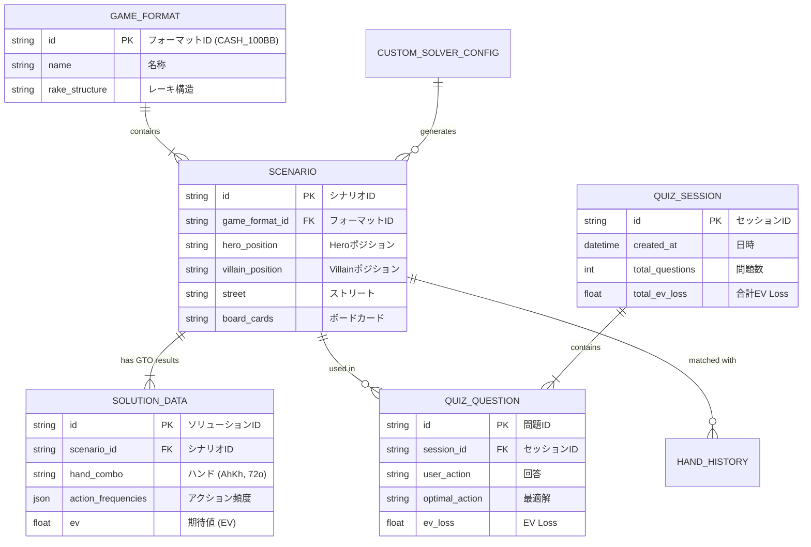

# 🎴 ローカルGTOウィザード (Local GTO Wizard) プロジェクト仕様書

> [!abstract] 概要
> 本ドキュメントは、完全無料・ローカル環境（PC上）で動作する**「ローカルGTOポーカー学習ツール (Local GTO Wizard)」**のプロジェクト仕様書です。
> Obsidian Vault の運用ルール（[[CLAUDE]] / [[01_Imo/Obsidian_Usage_Rules]]）に基づき、`03_AI/` フォルダに出力・管理されています。
> 本ツールは Obsidian のノート内に `<iframe src="...">` 経由で埋め込み、Obsidian上で直接操作・学習できるよう設計されています。

---

## 🎯 1. プロジェクト目的 & 特徴

1. **完全無料 (0円)**: クラウドサーバーや有料APIを使わず、全機能をローカルPC上で動作。
2. **Obsidian完全統合**: 単一HTML/Webアプリとしてビルドし、Obsidianノート内で直接動かせるUI構造。
3. **ローカルリソースのフル活用**: C++製のオープンソースGTOソルバー（`TexasSolver`等）をローカルCPUでバックグラウンド実行。

---

## 📐 2. システムアーキテクチャ & ER図

---

## 🛠️ 3. 実装機能 & 開発フェーズ

### フェーズ 1: コアWebビューア ＆ クイズトレーナー
- **13x13 ハンドマトリクス描画**: 169コンボの色分け頻度表示。
- **GTO対戦クイズ**: ランダムシチュエーション出題とリアルタイム EV Loss 判定。
- **Obsidian iframe 埋め込み対応**: レスポンシブUIの最適化。

### フェーズ 2: ローカルソルバー連携 ＆ HHアナライザー
- **TexasSolver CLI 連携**: 任意条件のローカルリアルタイムGTO計算。
- **ハンド履歴 (HH) パース**: テキストログの一括読み込みとミスの自動判定。

---

## 🔗 関連ドキュメント・関連ノート

* [[03_AI/Poker_Memo_Tool_Specification]] — ポーカーメモ統合Webツール仕様書
* [[01_Imo/Poker_Strategy_Embed]] — Obsidian HTML埋め込みノート一覧
* [[Dashboard]] — ポータル・ダッシュボード
