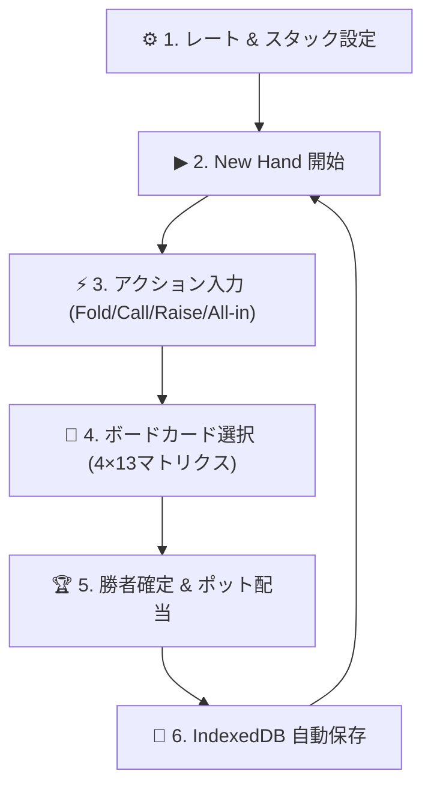

# 🎴 ポーカーメモWebツール ユーザーマニュアル (取扱説明書)

> [!info] 概要
> 本ドキュメントは、**ポーカーメモWebツール (`Poker Memo Web`)** の基本操作から便利な機能（4×13カードピッカー、Undo、ハンドリプレイ、テキスト共有、JSONバックアップ）までの全使い方を解説するユーザーマニュアルです。
> 関連仕様書: [[03_AI/Poker_Memo_Tool_Specification]] | [[03_AI/Poker_Memo_Implementation_Guide]]

---

## 🌐 WebアプリのアクセスURL

- **本番URL (PC / スマホ共通)**: **https://mrdayama.github.io/ai-tool/poker-memo.html**
- **対応環境**: iOS Safari, Android Chrome, PC (Chrome, Edge, Firefox, Safari)
- **オフライン対応**: PWA仕様のため、一度アクセスすればネットが繋がらない場所でも操作可能

---

## 🖥️ 画面構成（PC / スマホ）

### PCレイアウト (3カラム)
* **左パネル**: ブラインド設定・プレイヤー/スタック設定・アクションキーパッド
* **中央パネル**: 円形SVGポーカー卓 (8〜9名対応) ＆ コミュニティカード枠
* **右パネル**: ポット額 (メイン/サイド) ＆ アクション履歴 ＆ リプレイ再生コントローラー

### スマホレイアウト (レスポンシブ + ボトムシート)
* **画面上部**: 円形ポーカー卓 ＆ コミュニティカード
* **画面下部**: 引き出し式ボトムシート（**「入力」** / **「ブラインド/スタック」** / **「履歴/共有」** タブ）

---

## 🎮 基本的な操作フロー（1ハンドの流れ）



### Step 1: レート ＆ スタック設定
1. **卓人数**: 2名(HU) 〜 9名(Full Ring) から選択
2. **レート**: `0.5/1`, `1/2`, `2/5` などのプリセットボタン、またはカスタム数値入力
3. **アンティ**: `BB Ante` (BBが全員分) / `通常 Ante` / `なし` を選択
4. **スタック設定**:
   * 「全員のスタック (BB数)」欄に数値（例: `100`）を入れて **「全員に適用」** を押すと全座席のスタックが一括設定されます。
   * 個別設定リストからプレイヤー名や特定プレイヤーのスタックを個別に変更可能。

---

### Step 2: ▶ New Hand 開始
* **`▶ New Hand 開始`** ボタンを押すと新しいハンドがスタートします。
* SB（スモールブラインド）、BB（ビッグブラインド）、BBアンティが自動的に該当プレイヤーのスタックから差し引かれ、メインポットに投入されます。
* ポジション（BTN, SB, BB, UTG...）やアクション待ちのプレイヤー（黄色く光る円）が自動的に切り替わります。

---

### Step 3: アクション入力
画面内のアクションボタンを使って、順番にアクションをタップ記録します。

| ボタン | 説明 |
|---|---|
| **`FOLD`** | 降りる。プレイヤーが減光表示され、このハンドのアクションから除外されます。 |
| **`CHECK / CALL`** | チェック（賭け金なし）またはコール（現在の賭け金に合わせる）。自動で必要額を計算。 |
| **`RAISE ▾`** | レイズ（賭け金を上げる）。`2.5x`, `3x`, `POT` プリセットまたはカスタム額入力。 |
| **`ALL IN`** | 持ちチップ全額を賭ける。サイドポットが自動計算されます。 |
| **`↩ Undo (1手戻る)`** | **誤操作時**: 直前のアクションを取り消し、1手前の状態に完全復元します。 |

> [!tip] Min-Raise自動バリデーション
> ポーカーの公式ルールに基づき、最小レイズ額（Min-Raise）未満の金額を入力した場合は警告メッセージが表示されます。手持ちスタック以上の額を入力した場合は自動的に ALL IN に変換されます。

---

### Step 4: 🎴 コミュニティカード選択 (ボードカード)
テーブル中央の **`[ ? ]`** 枠、または **「🎴 タップしてボードカードを選択」** ガイドをタップすると、**4×13 のビジュアルカード選択モーダル** が起動します。

* **4行 (スート別)**: ♠ Spades, ♥ Hearts, ♦ Diamonds, ♣ Clubs
* **13列 (ランク昇順)**: A, 2, 3, 4, 5, 6, 7, 8, 9, 10, J, Q, K
* **重複防止**: すでにボードにあるカードは自動的にグレーアウトされタップできません。
* **キーボード手入力**: モーダル下部の入力欄に `As` (A♠), `Kh` (K♥), `Td` (10♦) などと入力して「決定」を押すこともできます。

※ **カード入力は任意です**。カードを選ばなくてもアクション入力やハンド進行は一切止まらず最後まで完了できます。

---

### Step 5: 🏆 勝者確定 ＆ ポット配当
全員のアクションが完了（または1人以外全員フォルド、あるいはショウダウン）すると、**「🏆 Winner を選択」** モーダルが表示されます。

1. **勝ったプレイヤーのボタンをタップ**（黄色く点灯）。
2. **引き分け（チョップ）の場合**: 勝者複数人を同時にタップして選択します。
3. **「確定して配当」** ボタンを押すと：
   * 集まったポットが勝者の持ちチップ（スタック）に配分されます。
   * メインポットが `$0` / `0.0 BB` にリセットされます。
   * **「🏆 【配当完了】 Seat X に 150.0 BB を配当しました！」** と案内が出ます。
4. あとは **`▶ New Hand 開始`** を押せば、すぐに次のハンドがスタートします。

---

## 🛠️ 便利機能の使い方

### 1. 📋 ハンドテキストのコピー共有 (`📋 ハンドコピー`)
ヘッダーまたはスマホ「履歴/共有」タブの **`📋 ハンドコピー`** を押すと、SNSやLINE、ポーカー掲示板に貼り付けられるフォーマット済みテキストがコピーされます。

```text
🎴 [Poker Memo Hand History]
Rate: 1/2 (BB Ante: 2) | 6-Max
Board: [A♠ K♥ 10♦]
Total Pot: 150.0 BB
-----------------------------------

[PREFLOP]
• Seat 1 (BTN): RAISE 2.5 BB
• Seat 2 (SB): CALL 2.5 BB
• Seat 3 (BB): CALL 2.5 BB
```

### 2. 🎬 アニメーションリプレイ再生
右パネル（スマホは「履歴/共有」タブ）のリプレイコントローラーで、記録したハンドをポーカーテーブルの動きとしてアニメーション再現できます。

* **`⏮ 前の手` / `⏭ 次の手`**: 1手ずつステップ実行
* **`▶ 再生` / `⏸ 一時停止`**: 自動アニメーション再生
* **速度切替**: `0.5x`, `1x`, `2x`, `4x` のスピード選択
* **シークバー**: 好きな場面へ直接スキップ

### 3. 💾 保存履歴の参照 ＆ 📥 JSONバックアップ
* **`💾 保存履歴`**: 過去にプレイして配当確定した全ハンドが IndexedDB に自動記録されています。過去のハンドを選択して **「復元」** を押せば、いつでも当時のリプレイを再現できます。
* **`📥 エクスポート`**: 保存されたハンド全データを JSON ファイルとしてパソコン/スマホにダウンロード。
* **`📤 復元(JSON選択)`**: JSONファイルを読み込ませることで別端末へハンド履歴を引き継げます。

---

## 🧠 ポーカーエンジンの自動ルール処理一覧

1. **HU (2名) 時のアクション自動反転**: ヘッズアップ時は BTN が SB（プリフロップで最初のアクション）、BB がポストフロップで最初のアクションに自動切替。
2. **All-in Runout 自動進行**: アクション可能なプレイヤーが1人以下（全員オールイン等）になった場合、自動的にショウダウンまでストリートを自動進行。
3. **サイドポット自動分割**: 複数人が異なるスタック額でオールインした際、Main Pot と Side Pot 1, 2... を完全自動分離計算。
4. **スプリットポット（チョップ）端数計算**: 同点勝利時、ポットの端数チップはSBポジションに最も近い座席へ自動付与。
