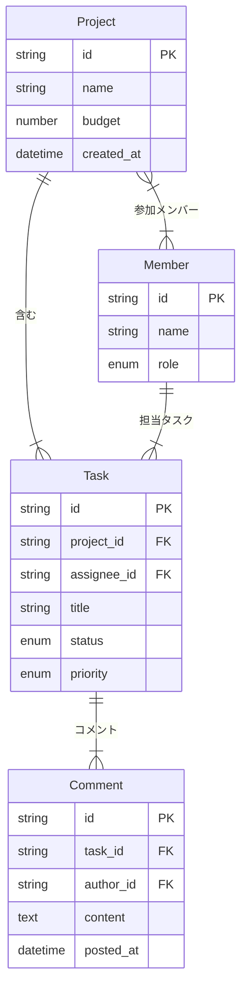
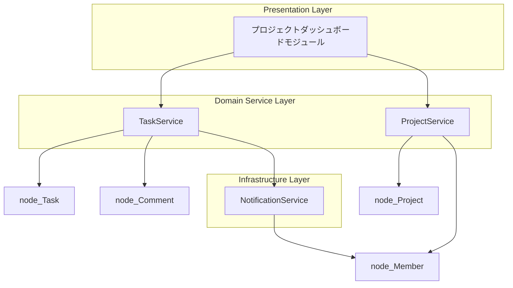

# 📘 【自動生成】AIタスク＆プロジェクト統合管理システム
> **概要**: 単一のJSONスキーマ定義から全ドキュメント・図・コード型を生成する実践サンプル (Ver: 1.2.0)
> *注: 本ドキュメントは単一の `schema.json` から全自動一括生成されています。*

---
## 1. 🗄️ データベース ER図 (Entity-Relationship Diagram)


---
## 2. 🏗️ 概念・アーキテクチャ依存図 (Concept Architecture)


---
## 3. 🔄 業務フロー・処理シーケンス (Workflows)
```mermaid
flowchart TD
    subgraph wf_task_progress_workflow ["タスク作業進行およびレビューフロー (Actor: 開発メンバー)"]
        start["TODOタスクを選択し「着手」ボタンを押す"]
        start --> status_in_progress
        status_in_progress["ステータスを IN_PROGRESS に変更し作業開始"]
        status_in_progress --> submit_review
        submit_review["成果物を添付して「レビュー依頼」を送信"]
        submit_review --> check_approval
        check_approval{"レビュアーによる内容確認"}
        check_approval -- 成功 / YES --> status_done
        check_approval -- 失敗 / NO --> reject_task
        reject_task["修正コメントを追加し修正依頼通知"]
        reject_task --> status_in_progress
        status_done["ステータスを DONE に変更し完了"]
        status_done --> end_node_task_progress_workflow(([終了]))
    end
```

---
## 4. 🖥️ UI画面およびコンポーネント設計 (UI Layout Specs)
### 🖥️ 画面: プロジェクトカンバンボード画面 (`/projects/:id/kanban`)
- **使用データエンティティ**: Project, Task, Member
- **コンポーネント構成**:
  - **`<ProjectHeader />`** (`Header`): プロジェクト名・メンバー一覧・進捗メーター
  - **`<KanbanColumnList />`** (`GridContainer`): BACKLOG/TODO/IN_PROGRESS/REVIEW/DONE の5カラム
  - **`<TaskCard />`** (`CardComponent`): タスク名・担当者アバター・優先度バッジ・期限
  - **`<TaskDetailDrawer />`** (`Drawer`): タスク詳細表示およびコメント投稿エリア

---
## 5. 💻 TypeScript 型定義 (Interface Code Definitions)
```typescript
// プロジェクト単位の情報
export interface Project {
  id: string; // プロジェクトID
  name: string; // プロジェクト名
  budget?: number; // 予算（千円）
  created_at: string // ISO Date string; // 作成日時
}

// 個別のタスク項目
export interface Task {
  id: string; // タスクID
  project_id?: string; // 所属プロジェクトID
  assignee_id?: string; // 担当者MemberID
  title: string; // タスクタイトル
  status?: "BACKLOG" | "TODO" | "IN_PROGRESS" | "REVIEW" | "DONE"; // 作業状態
  priority?: "LOW" | "MEDIUM" | "HIGH" | "URGENT"; // 優先度
}

// プロジェクトに参加するメンバー
export interface Member {
  id: string; // メンバーID
  name: string; // 氏名
  role?: "ADMIN" | "DEVELOPER" | "DESIGNER" | "VIEWER"; // 役割権限
}

// タスクに対するディスカッションログ
export interface Comment {
  id: string; // コメントID
  task_id?: string; // 対象タスクID
  author_id?: string; // 投稿者ID
  content: string; // コメント本文
  posted_at: string // ISO Date string; // 投稿日時
}

```