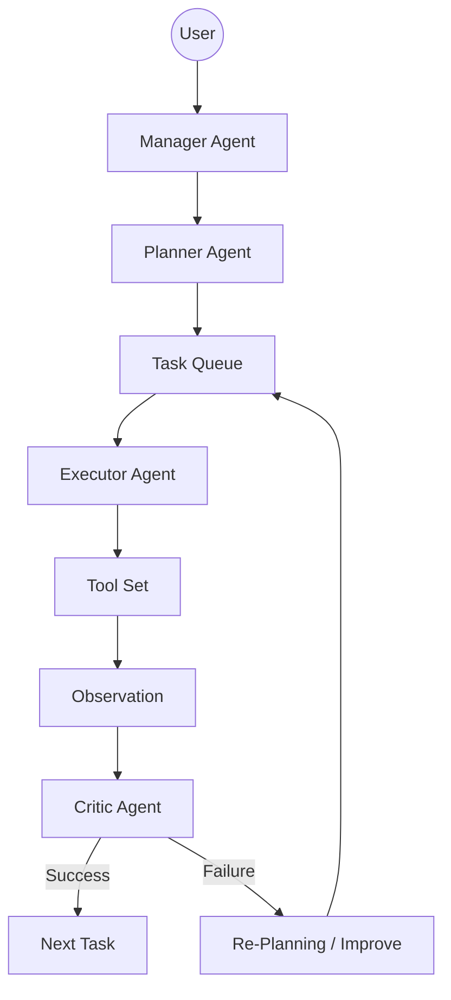
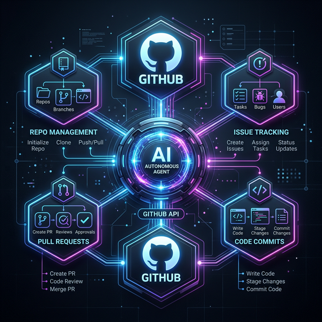

# AI Autonomous Agent System

Antigravity / Manus / Claude Code のような自律型AIエージェントのPython実装です。

## 1. システム設計
このエージェントはマルチエージェント構造を採用しており、ユーザーの目標（Goal）を達成するために自律的に計画、実行、評価のループを繰り返します。

### アーキテクチャ図


## 2. モジュール構成

- **`main.py`**: システムのエントリーポイント。CLIインターフェースを提供。
- **Agents (`agents/`)**:
  - `manager_agent`: 全体のオーケストレーションとメインループの管理。
  - `planner_agent`: 目標を小さなタスクに分解。
  - `executor_agent`: ツールを呼び出してタスクを実行。
  - `critic_agent`: 実行結果を評価。
- **Tools (`tools/`)**:
  - `web_search`: DuckDuckGoによるWeb検索。
  - `code_runner`: Pythonコードの実行。
  - `file_tool`: ファイルの読み書き・ディレクトリ一覧取得。
  - `shell_tool`: シェルコマンドの実行。
- **Memory (`memory/`)**:
  - `memory_store`: 実行履歴、タスクの状態、コンテキストの保存。
- **Utils (`utils/`)**:
  - `llm`: OpenAI APIとの通信。
  - `logger`: Richライブラリを使用したリッチなログ出力。

## 3. 開発者向けセットアップ手順

他のエンジニアがこのプロジェクトを素早くセットアップし、動作確認を行えるように自動化ツールを用意しています。

### クイックスタート (推奨)
1. **リポジトリをクローンまたは展開**
   ```bash
   cd ai-agent
   ```
2. **自動セットアップを実行**
   ```bash
   python setup.py
   ```
   このスクリプトは以下の作業を自動で行います：
   - 仮想環境（venv）の作成
   - 依存パッケージ（requirements.txt）のインストール
   - `.env.example` から `.env` の生成

3. **環境変数の設定**
   `.env` ファイルを開き、`OPENAI_API_KEY` を実際のAPIキーに書き換えてください。

4. **設定チェックの実行**
   APIキーの設定や依存関係が正しいか、ヘルスチェックツールで確認します：
   ```bash
   python config_check.py
   ```
   ※ `venv` をアクティベートした状態で実行してください。

### GitHub連携 (オプション)
GitHubリポジトリの操作（Issueの作成、ファイル取得、リポジトリ一覧表示）を自律的に行わせることができます。
1. [GitHubの公式サイト](https://github.com/settings/tokens)で「Personal Access Token (classic)」を作成します。
   - 必要な権限: `repo`
2. `.env` ファイルに以下を追記します：
   ```env
   GITHUB_TOKEN=あなたのトークン
   ```



### 実行方法
CLI（対話モード）を開始する場合：
```bash
python main.py
```

引数で直接目標を指定する場合：
```bash
python main.py "今日の天気を調べて、要約をweather.txtに保存して"
```

## 4. プロジェクト構成の拡張
エンジニアがツールを追加する際は、`tools/` ディレクトリに新しいモジュールを作成し、`agents/executor_agent.py` の `self.tools` 辞書にメソッドを登録するだけで完了します。

### サンプル目録
- `main.py`: エントリーポイント
- `setup.py`: 自動環境構築用
- `config_check.py`: 環境・API通信テスト用
- `requirements.txt`: 依存ライブラリ一覧
- `memory/memory.json`: 実行履歴（自動生成）

## 5. 実行ファイル（EXE）の作成

Pythonがインストールされていない環境でも動作するよう、単一の実行ファイルを生成できます。

1.  **ビルドの実行**:
    ```bash
    python build_exe.py
    ```
2.  **生成物の確認**:
    ビルド完了後、`dist/ai-agent.exe`（Windowsの場合）が生成されます。
3.  **注意点**:
    実行ファイルと同じディレクトリに `.env` を配置する必要があります。

## 6. ライセンス
このプロジェクトは MIT ライセンスの下で提供されています。自由に改変、再配布が可能です。
